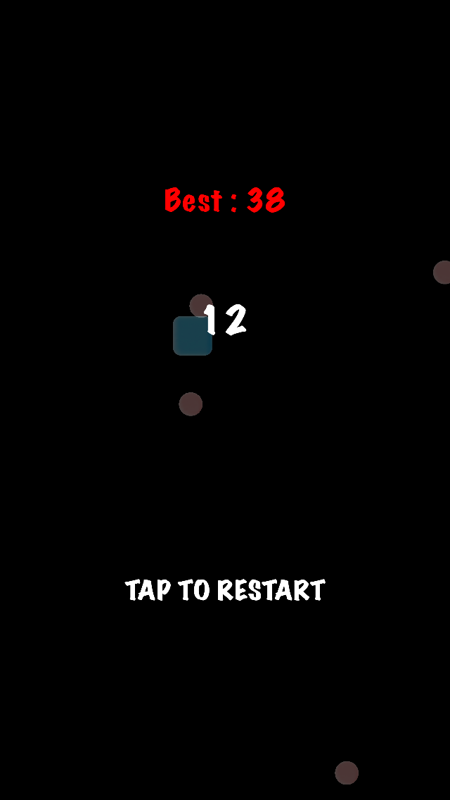
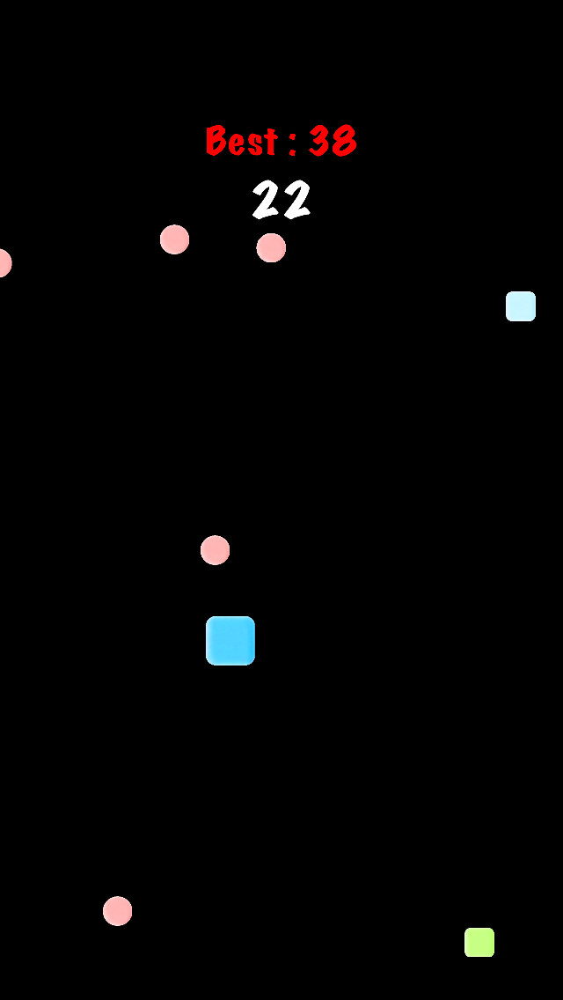

# Block Party

This is a simple game where the player moves around to avoid circles and collect squares.

There are two versions for this game. One version is written using Swift2 and SpriteKit and the other version is written using Objective-C and SpriteKit.

# Screenshots

